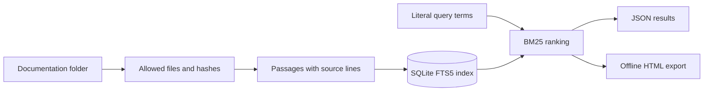

# DocSearch

Search a local documentation folder with ranked passages, excerpts, relative file paths, and source line ranges. DocSearch uses SQLite FTS5's BM25 ranking, gives headings extra weight, and updates only changed documents. It can export an offline HTML results page.

**Status:** Implemented local portfolio project created with Codex during this task. It performs keyword retrieval without generating answers or sending documents to a service. Read the [engineering and interview notes](ENGINEERING.md).

## Quick start

Prerequisites: Python 3.11 or newer, with SQLite compiled with FTS5. No third-party Python packages, model downloads, accounts, API keys, or environment variables are needed. Run commands from this folder; use `python3` where appropriate.

```sh
python --version
python -c "import sqlite3; c=sqlite3.connect(':memory:'); c.execute('CREATE VIRTUAL TABLE check_fts USING fts5(text)'); print('FTS5 available')"
python demo.py
python -m unittest discover -s tests -v
```

The demo indexes three synthetic documents, verifies that a second run changes none, and finds four passages containing `transaction`. Open `var/demo.html` in a browser to view the report.

For persistent use:

```sh
python docsearch.py --db var/search.db index examples/docs
python docsearch.py --db var/search.db search "lease token"
python docsearch.py --db var/search.db search "transaction" --html var/results.html
```

Run `index` again after adding, changing, or deleting a document. The database belongs to one source root; use another database to index a different root. The FTS5 capability check above gives a concrete error if your Python distribution lacks FTS5; use a Python distribution that includes it.

## Implemented behavior

- UTF-8 Markdown, text, and reStructuredText files up to 1 MiB each.
- Passages split at Markdown headings or a 60-line boundary.
- Incremental indexing using content hashes and a single transaction.
- Removal of deleted or newly excluded files from search results.
- SQLite BM25 ranking with higher heading weight and deterministic tie-breaking.
- Literal query terms joined with AND within one passage; punctuation is ignored.
- Up to 100 results, limited query length, match excerpts, and indexed line ranges.
- Escaped offline HTML with local source links and responsive layout.

## Architecture



## Privacy and configuration

Choose a specific documentation folder with the `index` argument. Hidden files, hidden folders, common build/vendor directories, and symlinks are skipped. This is not a secret scanner: a credential placed in an ordinary Markdown document would be indexed. Use only the synthetic example folder for public demos.

`--db` controls the database; `--limit` controls search results; `--html` creates an optional local export. No `.env` file is required. The index contains document text. HTML exports include excerpts and local file paths, so inspect them before sharing. Generated reports and databases are ignored by Git.

## Verification

Tests cover source line ranges, incremental updates and deletion, excluded paths, literal query handling, HTML escaping, Unicode search, chunk boundaries, oversized/non-UTF-8 files, root isolation, and rollback after an injected storage failure. A GitHub Actions workflow is prepared; its remote execution is not yet verified.

## Limitations

Ranking is provided by SQLite, not a custom BM25 implementation. There are no embeddings, semantic search, generated answers, PDF parsing, OCR, hosted service, authentication, or live filesystem watcher. `.rst` and `.txt` use the same line-based chunking and only recognize Markdown-style headings. Terms must appear in one passage; there is no stemming or cross-passage matching. Source line ranges describe the indexed snapshot and may become stale until reindexing. Local links open files but do not jump to the cited line. This is not hardened against malicious concurrent filesystem changes.
