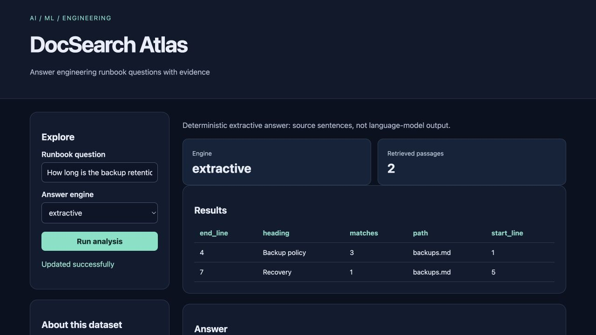

# DocSearch Atlas

Answer engineering runbook questions with evidence for **on-call engineers**.

Original topic: **Domain-Specific RAG Application** from [the source post](https://www.instagram.com/p/DdyMaogE4ud/).

> Local portfolio implementation developed with Codex assistance. Measured results and limitations are documented; no production adoption, revenue or hiring outcome is claimed.



## What works

- Incremental retrieval
- citations
- grounded answer composition
- optional local LLM

[Example output](reports/example-output.json) · [Recorded checks](reports/test-results.txt) · [Learning and interview guide](LEARNING_GUIDE.md)

## Start

Python 3.12 is the validated Python runtime. Run commands from this repository directory. Windows users activate `.venv\Scripts\activate` instead of `source`.

```sh
python3.12 -m venv .venv
source .venv/bin/activate
python -m pip install -r requirements.txt
python app.py
```

Open **http://127.0.0.1:8080**. Keep the process running. Set `PORT` to use another port. The Python development servers are intended for local demonstrations.

For actual local model inference, run `python download_model.py` once, then select the local language-model option. The default non-model mode is clearly labeled. Downloaded weights stay under ignored `var/model/`. No paid API is needed.

## Demonstration

Ask about backup retention in extractive mode, inspect the cited source, then download the model and compare local-llm mode. Try an unrelated question and inspect the no-evidence response.

## Architecture and decisions

Browser controls → validated Flask API → project analysis/workflow → results and export.

Stack: SQLite FTS5 · Flask.

1. Retain the existing incremental SQLite FTS5 engine and source line ranges.
2. Separate extractive answers from actual local-language-model generation so the interface never disguises one as the other.
3. Return retrieved passages and abstain on empty retrieval; generated answers remain reviewable against their context.

## Verification

```sh
python -m pytest -q
```

See [VERIFICATION.md](VERIFICATION.md) for actual executed checks, setup verification, model/data results and any outstanding environment limitations. The [recorded CI runs](reports/ci-verification.json) passed for the linked source revision.

## Data and attribution

Authored runbooks; existing DocSearch code. See [DATA_AND_SOURCES.md](DATA_AND_SOURCES.md) for provenance and usage notes. Original project code is MIT unless a preserved source file or dependency states otherwise. Model and third-party data licenses remain separate.

## Limitations and next improvement

Small synthetic Markdown corpus; lexical retrieval is not semantic search. The small model can hallucinate, answer incorrectly, or follow malicious document instructions. Local demo documents are trusted; no secrets or tools are available to the model. Source citations identify retrieved context, not automatic claim verification.

Suggested extension: Add a new runbook and a retrieval test that checks the expected source appears in the top three.

## Honest portfolio use

This implementation and documentation were developed with substantial Codex assistance. Before presenting it, run the demonstration, explain the design choices, and complete the suggested independent modification. Do not describe generated code as work experience, an accepted upstream contribution, or a deployed production service.
